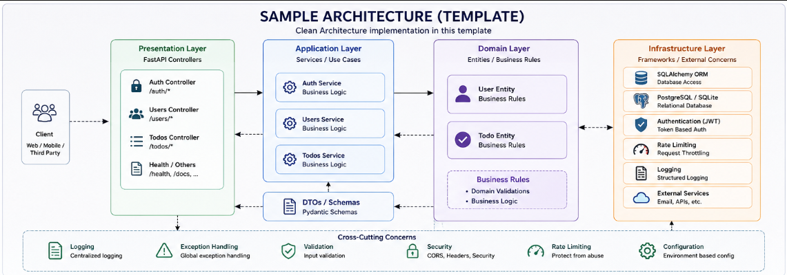
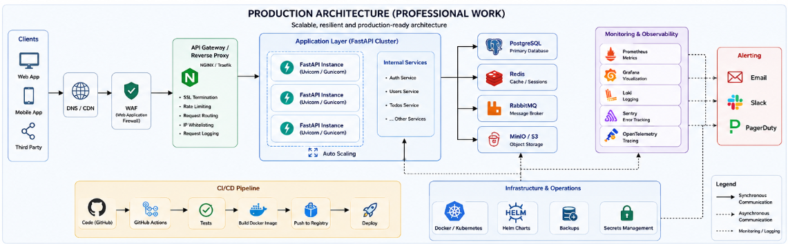
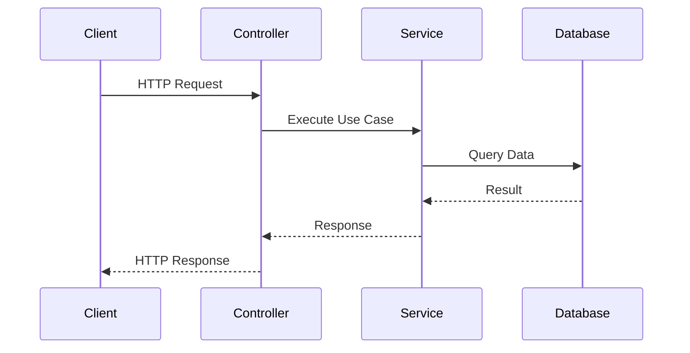

# 🚀 FastAPI Clean Architecture Template

<div align="center">




<br>


Production-ready FastAPI Clean Architecture Template designed for scalable and maintainable backend systems.

</div>

---

# 📚 Table of Contents

* Overview
* Architecture
* Project Structure
* Features
* Getting Started
* Testing
* Production Architecture
* Roadmap

---

# 🎯 Overview

This repository demonstrates how to build scalable backend applications using:

* Clean Architecture
* FastAPI
* SQLAlchemy
* PostgreSQL
* Docker
* Pytest

The template focuses on:

✅ Maintainability

✅ Scalability

✅ Testability

✅ Separation of Concerns

---

# 🏛 Template Architecture

The architecture implemented in this repository:

<p align="center">

</p>

## Layer Responsibilities

### Presentation Layer

Responsible for:

* Controllers
* Request Validation
* Response Formatting

### Application Layer

Responsible for:

* Services
* Use Cases
* Business Workflows

### Domain Layer

Responsible for:

* Entities
* Business Rules
* Core Logic

### Infrastructure Layer

Responsible for:

* Database
* Authentication
* Logging
* Rate Limiting

---

# 📂 Project Structure

```text
src
│
├── auth/
│   ├── controller.py
│   ├── service.py
│   └── models.py
│
├── users/
│   ├── controller.py
│   ├── service.py
│   └── models.py
│
├── todos/
│   ├── controller.py
│   ├── service.py
│   └── models.py
│
├── entities/
│   ├── user.py
│   └── todo.py
│
├── database/
│   └── core.py
│
├── api.py
├── main.py
├── exceptions.py
├── logging.py
└── rate_limiter.py

tests/
├── e2e/
├── test_auth_service.py
├── test_users_service.py
└── test_todos_service.py
```

---

# ✨ Features

## Authentication

* JWT Authentication
* Login
* Registration
* Password Hashing

## Database

* SQLAlchemy ORM
* PostgreSQL
* SQLite Support

## Security

* Rate Limiting
* Validation
* Exception Handling

## Testing

* Unit Tests
* Integration Tests
* E2E Tests

## Developer Experience

* Docker Support
* Clean Folder Structure
* Fast Startup

---

# 🔄 Request Flow



---

# 🐳 Running with Docker

Build and run:

```bash
docker compose up --build
```

Open:

```text
http://localhost:8000
```

Swagger:

```text
http://localhost:8000/docs
```

Stop:

```bash
docker compose down
```

---

# 💻 Local Development

Install dependencies:

```bash
pip install -r requirements-dev.txt
```

Run application:

```bash
uvicorn src.main:app --reload
```

---

# 🧪 Testing

Run all tests:

```bash
pytest
```

Coverage:

```bash
pytest --cov=src
```

---

# 🏭 Production Architecture (Recommended Evolution)

As your project grows, the architecture typically evolves into something like this:

<p align="center">

</p>

Production-grade architecture usually includes:

* API Gateway
* Load Balancer
* Multiple FastAPI Instances
* Redis Cache
* Message Broker
* Object Storage
* Monitoring Stack
* Distributed Tracing
* CI/CD Pipeline

---

# 📈 Roadmap

Future enhancements:

* CQRS
* Event Sourcing
* Redis Caching
* RabbitMQ
* Kafka
* Background Jobs
* OpenTelemetry
* Kubernetes
* GitHub Actions
* Terraform

---

# 🏆 Design Principles

* Clean Architecture
* SOLID Principles
* Dependency Inversion
* Domain Driven Design
* High Test Coverage
* Production Readiness

---

# 🤝 Contributing

Contributions are welcome.

Feel free to open issues, submit pull requests, or suggest improvements.

---

# ⭐ Support

If this project helped you:

* Star the repository
* Fork the repository
* Share it with the community

---

<div align="center">

Built with ❤️ using FastAPI

</div>