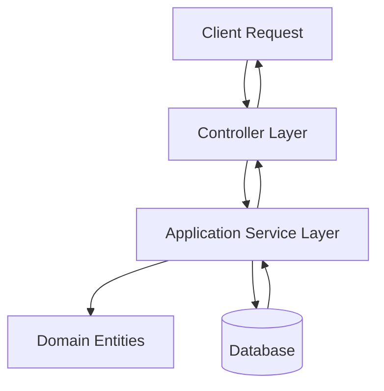
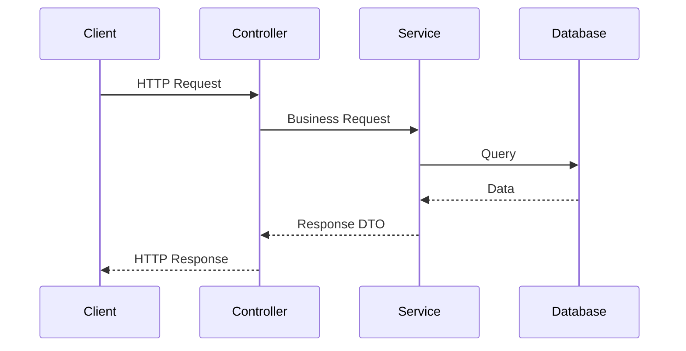
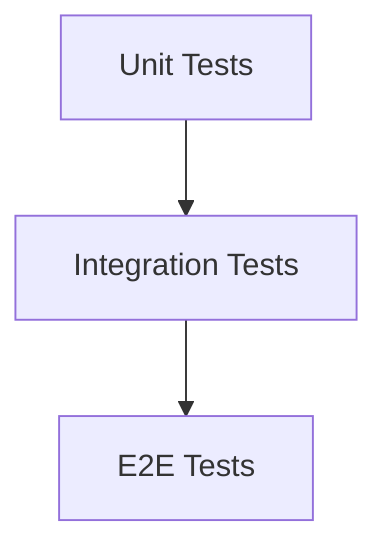

# 🚀 FastAPI Clean Architecture Template

<div align="center">


Production-ready Clean Architecture Template built with FastAPI, SQLAlchemy, PostgreSQL, Docker and Pytest.

Designed for scalable, maintainable, and testable backend applications.

</div>

---

# 📖 Overview

This repository provides a practical implementation of Clean Architecture using FastAPI.

The goal is to help developers bootstrap production-grade backend systems while maintaining:

* Separation of Concerns
* Testability
* Scalability
* Maintainability
* Framework Independence

---

# 🏛 Architecture



---

# 🔄 Request Lifecycle



---

# 📂 Project Structure

```text
src
│
├── auth
│   ├── controller.py
│   ├── service.py
│   └── models.py
│
├── users
│   ├── controller.py
│   ├── service.py
│   └── models.py
│
├── todos
│   ├── controller.py
│   ├── service.py
│   └── models.py
│
├── entities
│   ├── user.py
│   └── todo.py
│
├── database
│   └── core.py
│
├── api.py
├── main.py
├── exceptions.py
├── logging.py
└── rate_limiter.py
│
tests
├── e2e
├── test_auth_service.py
├── test_users_service.py
└── test_todos_service.py
```

---

# 🧩 Layers

## Domain Layer

Contains the core business entities and business rules.

```text
entities/
├── user.py
└── todo.py
```

Responsibilities:

* Business Entities
* Domain Rules
* Framework Independent Logic

---

## Application Layer

Contains business workflows and use cases.

```text
auth/service.py
users/service.py
todos/service.py
```

Responsibilities:

* Use Cases
* Business Processes
* Validation Rules

---

## Presentation Layer

Responsible for HTTP communication.

```text
controller.py
```

Responsibilities:

* API Endpoints
* Request Validation
* Response Formatting

---

## Infrastructure Layer

Responsible for external concerns.

```text
database/
auth/
logging.py
rate_limiter.py
```

Responsibilities:

* Authentication
* Database Access
* Logging
* Rate Limiting

---

# ✨ Features

## Authentication

* JWT Authentication
* User Registration
* Login
* Password Hashing

## Database

* SQLAlchemy ORM
* PostgreSQL Support
* SQLite Support

## Security

* Rate Limiting
* Input Validation
* Exception Handling

## Testing

* Unit Tests
* Integration Tests
* End-to-End Tests

## Dev Experience

* Docker Support
* Clean Folder Structure
* Fast Setup

---

# 🏗 Feature Module Structure

Every feature follows the same structure:

```text
feature/
├── controller.py
├── service.py
└── models.py
```

Example:

```text
products/
├── controller.py
├── service.py
└── models.py
```

This keeps the project modular and scalable.

---

# 🐳 Running with Docker

## Build & Start

```bash
docker compose up --build
```

Application:

```text
http://localhost:8000
```

Swagger UI:

```text
http://localhost:8000/docs
```

Stop services:

```bash
docker compose down
```

---

# 💻 Running Locally

Install dependencies:

```bash
pip install -r requirements-dev.txt
```

Switch database configuration in:

```python
database/core.py
```

Replace PostgreSQL with SQLite if desired.

Start application:

```bash
uvicorn src.main:app --reload
```

---

# 🧪 Running Tests

Run all tests:

```bash
pytest
```

Run a specific test file:

```bash
pytest tests/test_users_service.py
```

Run with coverage:

```bash
pytest --cov=src
```

---

# 📊 Testing Strategy



### Unit Tests

Fast, isolated tests for services and business logic.

### Integration Tests

Verify interaction between layers.

### E2E Tests

Validate complete user flows.

---

# 🔧 Technology Stack

| Category         | Technology |
| ---------------- | ---------- |
| Language         | Python     |
| Framework        | FastAPI    |
| ORM              | SQLAlchemy |
| Database         | PostgreSQL |
| Local Database   | SQLite     |
| Authentication   | JWT        |
| Containerization | Docker     |
| Testing          | Pytest     |

---

# 📈 Scalability Roadmap

Future improvements:

* CQRS
* Event-Driven Architecture
* Redis Caching
* Background Workers
* RabbitMQ
* Kafka
* OpenTelemetry
* Kubernetes Deployment
* CI/CD Pipelines
* Distributed Tracing

---

# 🎯 Design Principles

✅ Clean Architecture

✅ SOLID Principles

✅ Separation of Concerns

✅ Dependency Inversion

✅ High Testability

✅ Production Ready

---

# 🤝 Contributing

Contributions are welcome.

Feel free to:

* Open Issues
* Submit Pull Requests
* Suggest Improvements

---

# ⭐ Support

If this project helps you:

* Star the repository
* Fork the repository
* Share it with others

---

<div align="center">

Built with ❤️ using FastAPI and Clean Architecture

</div>
